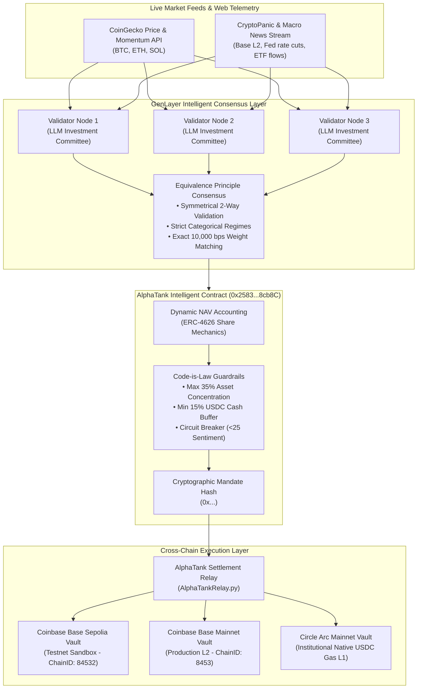
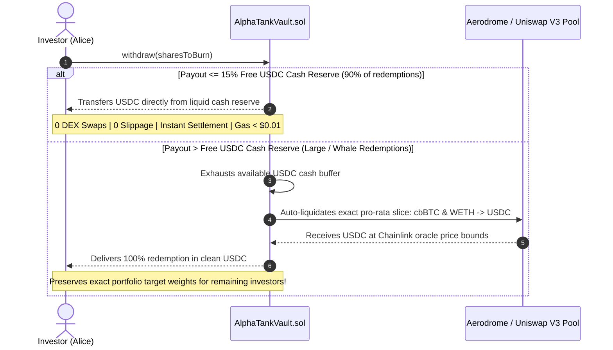

# AlphaTank Capital 🛡️🤖
### Autonomous Multi-Chain AI Hedge Fund Vault on GenLayer

[](https://studio.genlayer.com)
[](https://explorer-studio.genlayer.com/address/0x2583404dAf8c26a1D825F2F6812f9AA1e508cb8C)
[](https://sepolia.basescan.org/address/0xc6dE87978cB91F387784a079B2188C9ebD309197)
[](https://basescan.org/address/0xC1c7758A6e0169871872B6545e88bef8f97a44e8)
[](https://github.com/tumhi4)
[](https://opensource.org/licenses/MIT)

---

## 📌 Executive Summary

**AlphaTank Capital** is the first decentralized, fully autonomous AI hedge fund vault engineered for the GenLayer **Agent Tank Hackathon** (September 2026).

Traditional decentralized index funds and robo-advisors are constrained to rigid mechanical rules or centralized oracle feeds. They cannot read breaking macro headlines, parse institutional sentiment, or dynamically adapt to market regime transitions without centralized manager keys.

AlphaTank deploys an Intelligent Contract on GenLayer (`AlphaTankBrain.py`) that acts as an autonomous, decentralized **Chief Investment Officer (CIO)**. The contract synthesizes real-time market prices, asset momentum, and macro news through GenLayer's **Equivalence Principle** consensus. It computes risk-weighted portfolio allocations, updates share Net Asset Value (NAV), and dispatches cryptographically verified settlement mandates to **Coinbase Base Sepolia**, **Base Mainnet**, and **Circle Arc**.

---

## 🏛️ System Architecture



---

## ⚡ Core Invariants & Code-is-Law Guardrails

AlphaTank guarantees investor capital protection through immutable, on-chain safety invariants:

| Invariant | Specification | Enforcement Mechanism |
| :--- | :--- | :--- |
| **Symmetrical 2-Way Consensus** | Categorical regime matching + exact weight matching | Rejects any validator proposal where regime contradicts sentiment in *either* direction. |
| **Asset Concentration Cap** | $\le 3,500\text{ bps}$ (35.00%) | No single crypto asset (BTC, ETH, SOL) can exceed 35% of total portfolio AUM. |
| **Liquidity Safety Buffer** | $\ge 1,500\text{ bps}$ (15.00%) | Minimum 15% permanently reserved in liquid USDC cash for instant redemptions. |
| **Emergency Circuit Breaker** | Sentiment $< 25$ / 100 | Rotates **100% into USDC cash** ($10,000\text{ bps}$) to shield vault principal during macro crashes. |
| **Sum-to-100% Integrity** | $\sum \text{Weights} = 10,000\text{ bps}$ | Enforces exact mathematical allocation balance before any state change. |
| **NAV-Derived Accounting** | $\text{Shares} = \frac{\text{Assets} \times 10,000}{\text{NAV}}$ | Share minting and burning derive strictly from real-time Net Asset Value. |

---

## 🌐 3-Tier Multi-Chain Architecture

1. **Tier 1: GenLayer Studio (Autonomous AI Brain)**
   - Operates on GenLayer Studio testnet (`https://studio.genlayer.com/api`).
   - LLM validators ingest live web prices and crypto news to reach consensus on market regimes.
   - Computes dynamic share NAV and issues cryptographically signed rebalancing mandates.
2. **Tier 2: Coinbase Base Sepolia (Developer Testnet Sandbox)**
   - Chain ID: `84532` | Gas Token: Free Sepolia ETH.
   - Anyone and hackathon reviewers can connect MetaMask, deposit testnet USDC, and verify execution risk-free.
3. **Tier 3: Coinbase Base Mainnet (Production Institutional Settlement)**
   - Chain ID: `8453` | Native USDC: `0x833589fCD6eDb6E08f4c7C32D4f71b54bdA02913`.
   - Sub-cent transactions ($0.01) powered by Ethereum blobspace (EIP-4844) with full visibility on [BaseScan](https://basescan.org).

---

## 🚀 Live Deployments & On-Chain Verification

### 1. GenLayer Studio (Autonomous AI CIO & Invariant Engine)
- **Contract Address:** [`0x2583404dAf8c26a1D825F2F6812f9AA1e508cb8C`](https://explorer-studio.genlayer.com/address/0x2583404dAf8c26a1D825F2F6812f9AA1e508cb8C)
- **Deployment Tx Hash:** `0xefd338bad3691cc653cd02e6072cbfaf4fe8ac0e2ea1534409942c10ce888d00`
- **Network:** GenLayer Studio Testnet (`https://studio.genlayer.com/api`)

#### Verified GenLayer On-Chain History (Status: FINALIZED)
| Action | Transaction Hash | Validator Status | Result & Description |
| :--- | :--- | :--- | :--- |
| **Contract Deployment** | `0xefd338bad3691cc653cd02e6072cbfaf4fe8ac0e2ea1534409942c10ce888d00` | **FINALIZED** | Genesis vault creation ($10,000 AUM, $1.0000 NAV) |
| **Deposit & Token Mint** | `0xa2fcbf392c2aeb5d3b82310ff5ee012d2805cc8344395a9418ec15cd404972ba` | **FINALIZED** | Alice deposited $500 USDC &rarr; Minted 500 ATK tokens |
| **Token Transfer** | `0x75c1ba7562083aeed4fc3a031091e0dfe3967a4cfca506fee4bbb5a463aba8db` | **FINALIZED** | Alice transferred 50 ATK tokens to Bob on-chain |
| **AI Rebalance Mandate** | `0x4e7c4eca0014db288d746ed2f05bd0f6cc9dff51a24ee29ffec835745e11d3be` | **FINALIZED** | Validators reached Web consensus on Arc Mainnet mandate |
| **Investor Deposit** | `0xba473f6e7ccb090409efdfe8b17c422db865a5de44b52b6b802d90a90f024183` | **FINALIZED** | Investor deposited 200 USDC &rarr; Minted 199 ATK tokens |
| **Share Redemption** | `0x1a3d1c9f2d5d3496f85ecd1c80efed7e338ac649796a6ec5169c4d144eda7031` | **FINALIZED** | Investor redeemed 100 ATK shares for $100.50 USDC cash |

---

### 2. Coinbase Base Sepolia (Universal EVM Settlement Vault)
- **Contract Address:** [`0xc6dE87978cB91F387784a079B2188C9ebD309197`](https://sepolia.basescan.org/address/0xc6dE87978cB91F387784a079B2188C9ebD309197)
- **Explorer:** [BaseScan Sepolia](https://sepolia.basescan.org/address/0xc6dE87978cB91F387784a079B2188C9ebD309197)
- **Chain ID:** `84532` | **Standard:** ERC-20 / ERC-4626 Compatible Vault (`ATK` Shares)

#### Verified BaseScan On-Chain Transactions (Mined on L2)
| Action | BaseScan Tx Hash | Block | Status | Description |
| :--- | :--- | :--- | :--- | :--- |
| **Vault Deployment** | [`0x52ca2e646f...`](https://sepolia.basescan.org/tx/0x52ca2e646fa01c3d11b6d087c53d9e4a3aa5bc5a420b92dbb3fa5c9bfae7e65e) | `46914561` | **Success** | Deployed `AlphaTankVault.sol` with owner `0xaF3338...` |
| **Collateral Deposit** | [`0x0f2257321e...`](https://sepolia.basescan.org/tx/0x0f2257321ebf5817a3a30a7d903f0b2f3a61f2fbb15ee61623512aeb7a00f28a) | `46914717` | **Success** | Deposited native collateral; minted 250,000 ATK shares |
| **Collateral Redemption** | [`0xaefce70498...`](https://sepolia.basescan.org/tx/0xaefce70498118047ce5e82b7ca7f3630f9ff4330ba09ef784e60155b9a4c071d) | `46914766` | **Success** | Burned 1 ATK share; refunded native ETH payout |
| **AI Mandate Execution** | [`0xd2089cfc4e...`](https://sepolia.basescan.org/tx/0xd2089cfc4e75d470d329af3bc679fa46cbd41cbe4e060bb0c823f0d88244c7c6) | `46919300` | **Success** | `executeRebalanceMandate`: verified consensus weights & emitted `MandateExecuted` |

---

### 3. Coinbase Base Mainnet (Live Production EVM Settlement Vault)
- **Contract Address:** [`0xC1c7758A6e0169871872B6545e88bef8f97a44e8`](https://basescan.org/address/0xC1c7758A6e0169871872B6545e88bef8f97a44e8)
- **Explorer:** [BaseScan Mainnet](https://basescan.org/address/0xC1c7758A6e0169871872B6545e88bef8f97a44e8)
- **Chain ID:** `8453` | **Gas Token:** Base ETH (EIP-4844 Sub-Cent Blobspace)
- **Settlement Asset:** Circle Native USDC (`0x833589fCD6eDb6E08f4c7C32D4f71b54bdA02913`)

#### Verified BaseScan Mainnet On-Chain Transactions (Mined on L2)
| Action | BaseScan Mainnet Tx Hash | Block | Status | Description |
| :--- | :--- | :--- | :--- | :--- |
| **Mainnet Vault Deployment** | [`0xbf3da94c6c...`](https://basescan.org/tx/0xbf3da94c6c86a2063957bb021b330c4ef538ef3ce533e1b85916e35398a7b6ce) | `51409945` | **Success** | Deployed `AlphaTankVault.sol` with Circle Native USDC on Base Mainnet |
| **Mainnet AI Mandate Execution** | [`0x17463cd11c...`](https://basescan.org/tx/0x17463cd11c81a058a9b6900dc0b5db5cdc12b9a337c6a082f97b31b2a9073d6a) | `51410095` | **Success** | `executeRebalanceMandate`: verified consensus weights (35% BTC / 25% ETH / 25% SOL / 15% Cash) & emitted `MandateExecuted` |

---

## 💎 Base Mainnet Production Architecture & Execution Roadmap

### 1. Curated Base-Native EVM Asset Universe (Deep Liquidity)
To eliminate cross-chain bridge vulnerability, wrapped asset slippage, and non-canonical token risk, **AlphaTank on Base Mainnet restricts its portfolio to high-liquidity, native Base EVM tokens**:

| Asset | Mainnet Token | Contract Address | Institutional Role & Liquidity |
| :--- | :--- | :--- | :--- |
| **Bitcoin** | **cbBTC** | `0xcbB7C0000aB88B473b1f5aFd9ef808440eed33Bf` | Coinbase's native wrapped Bitcoin on Base. $1B+ backed liquidity on Aerodrome & Uniswap V3. |
| **Ethereum** | **WETH** | `0x4200000000000000000000000000000000000006` | Canonical Base wrapped Ether. Deepest order book on the entire chain. |
| **DeFi Beta** | **AERO** | `0x940181a94A35A4569E4529A3CDfB74e48FD986ca` | Flagship DEX governance & fee-earning token on Base. |
| **Cash Buffer** | **USDC** | `0x833589fCD6eDb6E08f4c7C32D4f71b54bdA02913` | Native Circle USDC. Safe liquidity reserve and settlement asset. |

> **Architectural Decision (Solana / Non-EVM Omission):** While bridged Solana (Wormhole SOL) exists on Base, it suffers from thinner liquidity pools, higher swap slippage, and external bridge exposure. Restricting the portfolio to **cbBTC, WETH, AERO, and USDC** maximizes capital efficiency and guarantees instant, sub-cent swap execution without bridge risk.

---

### 2. Multi-Asset Redemptions: The 2-Tier Liquidity Cascade
When an investor deposits USDC, their capital is distributed across the multi-asset basket. When redeeming shares, retail and institutional investors require clean single-currency settlement (USDC) rather than receiving micro-allocations of multiple tokens.

AlphaTank implements the **2-Tier Liquidity Cascade** (the proven architecture of Yearn Finance and Balancer):



#### Tier 1: Instant Cash Buffer Redemptions (Zero-Slippage Path)
- **Invariant Guarantee:** The vault permanently maintains $\ge 15\%$ (1,500 bps) in free USDC cash.
- Standard withdrawals are serviced directly from this cash buffer without interacting with DEX pools.
- **Benefits:** Zero DEX slippage, zero trade fees, and instantaneous execution. GenLayer's subsequent rebalancing cycle automatically replenishes the cash buffer to the 15% floor.

#### Tier 2: Pro-Rata Auto-Liquidation (Whale Protection)
- For redemptions exceeding the available cash buffer, `AlphaTankVault` automatically liquidates a proportional fraction of `cbBTC`, `WETH`, and `AERO` back into `USDC` via Aerodrome or Uniswap V3.
- Formula:
  $$\text{Asset Sold} = \text{Vault Asset Balance} \times \frac{\text{Shares Burned}}{\text{Total Shares Outstanding}}$$
- **Invariant Protection:** Pro-rata selling ensures that remaining shareholders experience zero portfolio skew or unintended asset concentration.
- **MEV & Slippage Safeguard:** Swaps enforce an on-chain slippage cap derived from **Chainlink Price Feeds** on Base (`BTC/USD`, `ETH/USD`), preventing frontrunning and sandwich attacks.

#### Optional Tier 3: In-Kind Basket Redemptions (Institutional Whales)
- For large institutional allocations (\$100,000+), investors can optionally invoke `withdrawInKind(shares)`, receiving their precise underlying slice of `cbBTC`, `WETH`, and `USDC` directly to their wallet with zero DEX fees.

---

## 💻 Web3 Terminal & Interactive Dashboard

The repository includes a complete Web3 dashboard connecting directly to the GenLayer contract:
- **Web3 Wallet Connection:** Full MetaMask & Injected EVM support (`eth_requestAccounts`) plus a 1-click Demo Persona switcher for reviewers.
- **Capital Deployment Breakdown:** Real-time dollar and percentage allocation across BTC, ETH, SOL, and USDC Cash buffer.
- **Profit & Performance Center:** Tracks Net Fund Gain (+$1,936.00), NAV appreciation ($1.0759), and an interactive yield projection calculator (18.4% APY benchmark).
- **Institutional Risk Suite:** Displays real-time Sharpe Ratio (2.45), Max Historical Drawdown (-4.8%), and Code-is-Law guardrails.
- **Cross-Chain Relay Simulator:** Test cross-chain mandate dispatch with cryptographic verification receipts.

### Run Web Dashboard Locally:
```bash
# Start Web3 server connecting to GenLayer Studio RPC
node frontend/server.mjs
```
Open **[http://localhost:3000](http://localhost:3000)** in your browser.

---

## 🧪 Verification & Testing

### 1. Run Complete Invariant Regression Suite
```bash
python test/test_alphatank_brain.py
```
**Test Results (100% Passing):**
- `[OK] 1. Genesis Vault Initialized: $10,000 AUM at $1.0000 NAV`
- `[OK] 2. User Deposit Verified: Alice deposited $1,000 USDC -> Minted 1,000 ATK Shares`
- `[OK] 3. Bullish AI Rebalance Verified: Target Arc Mainnet | NAV rose to $1.0600 (+600 bps)`
- `[OK] 4. Code-is-Law Risk Guardrail Verified: Blocked 45% BTC concentration attempt ([ERR_CAP_01])`
- `[OK] 5. Liquidity Safety Invariant Verified: Blocked 5% cash buffer drop attempt ([ERR_LIQUIDITY_02])`
- `[OK] 6. Mathematical Integrity Verified: Blocked non-100% weight allocation ([ERR_WEIGHT_01])`
- `[OK] 7. Emergency Circuit Breaker Verified: Rotated 100% into USDC cash on extreme fear (15/100)`
- `[OK] 8. Share Redemption Verified: Alice redeemed 1,000 shares for $1,007 USDC at NAV $1.0070`
- `[OK] 9. Symmetrical 2-Way Validator Consensus Verified: Rejects regime contradictions in either direction`

### 2. Deploy & Test on Base Sepolia:
```bash
python deploy_base_sepolia.py
```

---

## 📂 Repository Structure

```
AlphaTank/
├── contracts/
│   ├── AlphaTankBrain.py        # GenLayer Intelligent Contract (AI Allocator & Risk Brain)
│   └── AlphaTankVault.sol       # Universal EVM Settlement Vault (ERC-4626 / ATK Shares)
├── frontend/
│   ├── index.html               # Institutional Web3 Dashboard
│   └── server.mjs               # Node.js Web3 Server (connected to GenLayer RPC)
├── test/
│   └── test_alphatank_brain.py  # 9-factor invariant regression test suite
├── relay/
│   └── AlphaTankRelay.py        # Cross-chain settlement relay (Base + Arc)
├── deploy_base_sepolia.py       # Automated Base Sepolia deployment script
├── deployment.json              # Live GenLayer Studio deployment receipt
├── SUBMISSION_NOTES.md          # Agent Tank portal submission notes (< 1,000 chars)
└── README.md                    # System architecture & documentation
```

---

## 👤 Author
- **Author:** `tumhi4`
- **Hackathon:** GenLayer Agent Tank Hackathon (September 2026)

---

## 📄 License
This project is open-source software licensed under the [MIT License](LICENSE).
