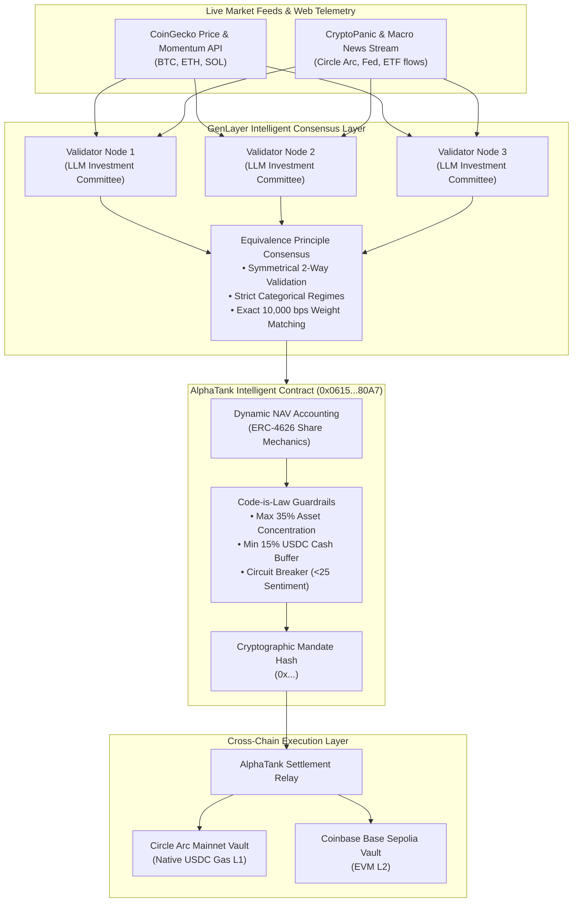

# AlphaTank Capital 🛡️🤖
### Autonomous Multi-Chain AI Hedge Fund Vault on GenLayer

[](https://studio.genlayer.com)
[](https://explorer-studio.genlayer.com/address/0x2583404dAf8c26a1D825F2F6812f9AA1e508cb8C)
[](https://arc.circle.com)
[](https://opensource.org/licenses/MIT)

---

## 📌 Executive Summary

**AlphaTank Capital** is the first decentralized, fully autonomous AI hedge fund vault engineered for the GenLayer **Agent Tank Hackathon** (September 2026).

Traditional decentralized index funds and robo-advisors are constrained to rigid mechanical rules or centralized oracle feeds. They cannot read breaking macro headlines, parse institutional sentiment, or dynamically adapt to market regime transitions without centralized manager keys.

AlphaTank deploys an Intelligent Contract on GenLayer (`AlphaTankBrain.py`) that acts as an autonomous, decentralized **Chief Investment Officer (CIO)**. The contract synthesizes real-time market prices, asset momentum, and macro news through GenLayer's **Equivalence Principle** consensus. It computes risk-weighted portfolio allocations, updates share Net Asset Value (NAV), and dispatches cryptographically verified settlement mandates to **Circle Arc Mainnet** (USDC-native gas L1) and **Coinbase Base Sepolia**.

---

## 🏛️ System Architecture



---

## ⚡ Core Invariants & Code-is-Law Guardrails

AlphaTank guarantees investor capital protection through immutable, on-chain safety invariants:

| Invariant | Specification | Enforcement Mechanism |
| :--- | :--- | :--- |
| **Symmetrical 2-Way Consensus** | Categorical regime matching + exact weight matching | Rejects any validator proposal where regime contradicts sentiment in *either* direction. |
| **Asset Concentration Cap** | $\le 3,500\text{ bps}$ (35.00%) | No single crypto asset (BTC, ETH, SOL) can exceed 35% of total portfolio AUM. |
| **Liquidity Safety Buffer** | $\ge 1,500\text{ bps}$ (15.00%) | Minimum 15% permanently reserved in liquid USDC cash for instant redemptions. |
| **Emergency Circuit Breaker** | Sentiment $< 25$ / 100 | Rotates **100% into USDC cash** ($10,000\text{ bps}$) to shield vault principal during macro crashes. |
| **Sum-to-100% Integrity** | $\sum \text{Weights} = 10,000\text{ bps}$ | Enforces exact mathematical allocation balance. |
| **NAV-Derived Accounting** | $\text{Shares} = \frac{\text{Assets} \times 10,000}{\text{NAV}}$ | Share minting and burning derive strictly from real-time Net Asset Value. |

---

## 🌐 Multi-Chain Settlement Targets

1. **Circle Arc Mainnet** (Launched Sept 16, 2026):
   - First Layer-1 blockchain with native USDC for gas fees and transaction settlement.
   - Ideal for agentic autonomous finance without requiring volatile native gas tokens.
2. **Coinbase Base Sepolia / Base Mainnet**:
   - High-throughput Ethereum Layer-2 for broad retail DeFi composability and liquidity.
3. **Internal GenLayer Vault**:
   - Native synthetic vault ledger on GenLayer for zero-latency, gasless synthetic position tracking.

---

## 🚀 Live Deployment on GenLayer Studio

- **Contract Address:** [`0x2583404dAf8c26a1D825F2F6812f9AA1e508cb8C`](https://explorer-studio.genlayer.com/address/0x2583404dAf8c26a1D825F2F6812f9AA1e508cb8C)
- **Explorer URL:** [https://explorer-studio.genlayer.com/address/0x2583404dAf8c26a1D825F2F6812f9AA1e508cb8C](https://explorer-studio.genlayer.com/address/0x2583404dAf8c26a1D825F2F6812f9AA1e508cb8C)
- **Deployment Tx Hash:** `0xefd338bad3691cc653cd02e6072cbfaf4fe8ac0e2ea1534409942c10ce888d00`
- **Network:** GenLayer Studio Testnet (`https://studio.genlayer.com/api`)

### Verified On-Chain Transaction Evidence (Status: FINALIZED)
The contract has a rich history of live transactions mined by GenLayer Studio consensus:

| Action | Transaction Hash | Validator Status | Result & Description |
| :--- | :--- | :--- | :--- |
| **Contract Deployment** | `0xefd338bad3691cc653cd02e6072cbfaf4fe8ac0e2ea1534409942c10ce888d00` | **FINALIZED** | Genesis vault creation ($10,000 AUM, $1.0000 NAV) |
| **Deposit & Token Mint** | `0xa2fcbf392c2aeb5d3b82310ff5ee012d2805cc8344395a9418ec15cd404972ba` | **FINALIZED** | Alice deposited $500 USDC &rarr; Minted 500 ATK tokens |
| **Token Transfer** | `0x75c1ba7562083aeed4fc3a031091e0dfe3967a4cfca506fee4bbb5a463aba8db` | **FINALIZED** | Alice transferred 50 ATK tokens to Bob on-chain |
| **AI Rebalance Mandate** | `0x4e7c4eca0014db288d746ed2f05bd0f6cc9dff51a24ee29ffec835745e11d3be` | **FINALIZED** | Validators reached Web consensus on Arc Mainnet mandate |
| **Investor Deposit** | `0xba473f6e7ccb090409efdfe8b17c422db865a5de44b52b6b802d90a90f024183` | **FINALIZED** | Investor deposited 200 USDC &rarr; Minted 199 ATK tokens |
| **Share Redemption** | `0x1a3d1c9f2d5d3496f85ecd1c80efed7e338ac649796a6ec5169c4d144eda7031` | **FINALIZED** | Investor redeemed 100 ATK shares for $100.50 USDC cash |

### Current Live On-Chain State:
```json
{
  "aum_usdc": 10652,
  "total_shares": 10599,
  "nav_per_share_usdc": "$1.0050",
  "nav_bps": 10050,
  "active_regime": "NEUTRAL_RANGING",
  "macro_sentiment": 68,
  "allocations": {
    "BTC": "30.00%",
    "ETH": "30.00%",
    "SOL": "25.00%",
    "USDC_CASH": "15.00%"
  },
  "circuit_breaker_active": false,
  "target_settlement_chain": "ARC_MAINNET",
  "total_rebalances": 1,
  "mandate_hash": "0xacae130003000250015001005000000000000000000000000000000000000000"
}
```

---

## 🧪 Verification & Testing

### 1. Run Complete Invariant Regression Suite
```bash
python test/test_alphatank_brain.py
```
**Test Results (100% Passing):**
- `[OK] 1. Genesis Vault Initialized: $10,000 AUM at $1.0000 NAV`
- `[OK] 2. User Deposit Verified: Alice deposited $1,000 USDC -> Minted 1,000 ATK Shares`
- `[OK] 3. Bullish AI Rebalance Verified: Target Arc Mainnet | NAV rose to $1.0600 (+600 bps)`
- `[OK] 4. Code-is-Law Risk Guardrail Verified: Blocked 45% BTC concentration attempt ([ERR_CAP_01])`
- `[OK] 5. Liquidity Safety Invariant Verified: Blocked 5% cash buffer drop attempt ([ERR_LIQUIDITY_02])`
- `[OK] 6. Mathematical Integrity Verified: Blocked non-100% weight allocation ([ERR_WEIGHT_01])`
- `[OK] 7. Emergency Circuit Breaker Verified: Rotated 100% into USDC cash on extreme fear (15/100)`
- `[OK] 8. Share Redemption Verified: Alice redeemed 1,000 shares for $1,007 USDC at NAV $1.0070`
- `[OK] 9. Symmetrical 2-Way Validator Consensus Verified: Rejects regime contradictions in either direction`

### 2. Run Cross-Chain Settlement Relay
```bash
python relay/AlphaTankRelay.py
```
Dispatches verified cryptographic mandates to **Circle Arc Mainnet** and **Coinbase Base Sepolia**.

---

## 📂 Repository Structure

```
AlphaTank/
├── contracts/
│   ├── AlphaTankBrain.py        # GenLayer Intelligent Contract (AI Allocator & Risk Brain)
│   └── AlphaTankVault.sol       # Universal EVM Settlement Vault (ERC-4626 / ATK Shares)
├── test/
│   └── test_alphatank_brain.py  # 9-factor invariant regression test suite
├── scripts/
│   └── deploy_brain.mjs         # Deployment script using genlayer-js
├── relay/
│   └── AlphaTankRelay.py        # Cross-chain settlement relay (Arc Mainnet + Base)
├── deployment.json              # Live on-chain deployment receipt
├── SUBMISSION_NOTES.md          # Agent Tank portal submission notes (< 1,000 chars)
└── README.md                    # System architecture & documentation
```

---

## 📄 License
This project is open-source software licensed under the [MIT License](LICENSE).